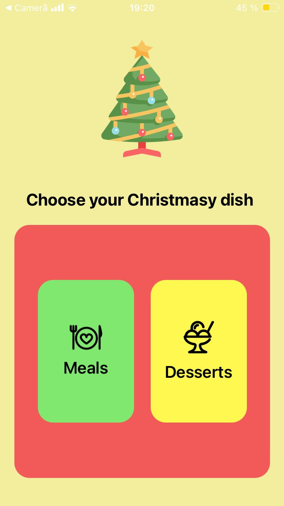
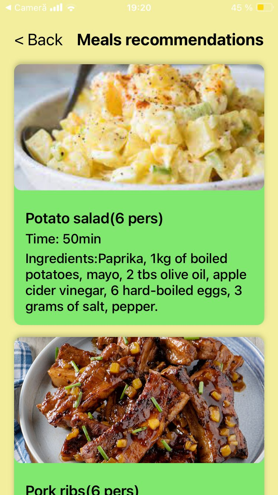
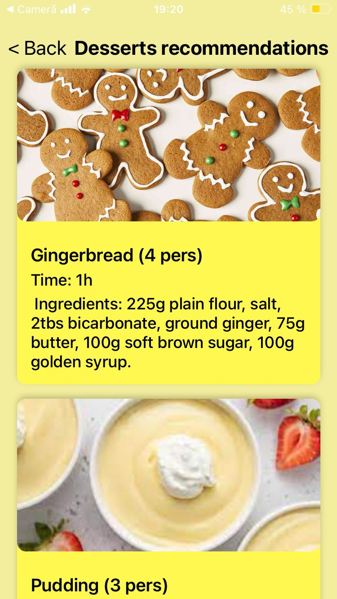

<h1>Christmas food cards application</h1>

This is a small application in which I used stack navigation to navigate between the 3 screens.

In this application you can find  cards with recipe suggestions for desserts and main dishes

<ul>
<li>Main screen</li>
 
<li>Meals screen</li>
 
<li>Desserts screen</li>

</ul>
